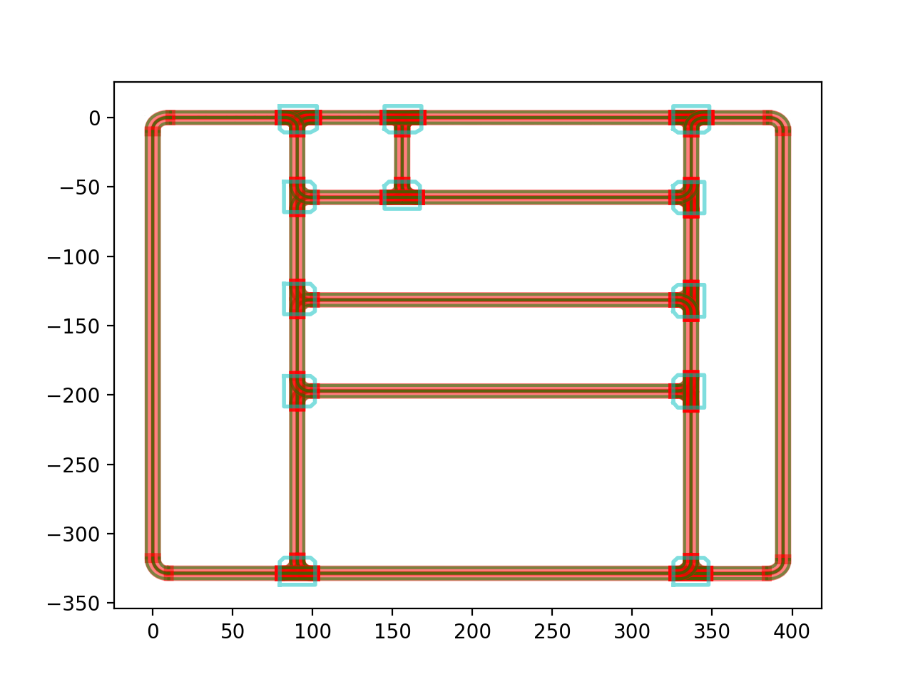

### Convert proto file
* Extract the map proto file from /modules/common_msgs/map_msgs under the Apollo project, and use the protobuf library in Python for serialization.
### Read the map file
* The map file is in the `.txt` format. There are also other format files such as `.xml` and `.bin`, which require additional reading methods.
* `get_pb_from_text_file()` comes from "modules\tools\common\proto_utils.py" under the Apollo project, which converts the data in .txt format into protobuf (pb) data.
* "apollo_map.txt" is the demo map file under the Apollo project, and "lane_segment.txt" is the data of one lane extracted from the former.
### Drawing
* Import the serialized data format, and perform map visualization drawing according to the map hierarchy.
* Each drawing function comes from "modules\tools\mapshow\libs\map.py" under the Apollo project.

